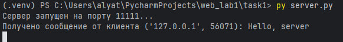
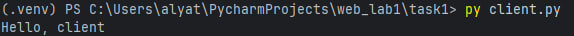

# Задание 1: UDP-клиент и сервер

## Условие
Реализовать клиентскую и серверную часть приложения.  
Клиент отправляет серверу сообщение «Hello, server», и оно должно отобразиться на стороне сервера.  
В ответ сервер отправляет клиенту сообщение «Hello, client», которое должно отобразиться у клиента.  

Требования:

- Использовать библиотеку `socket`.  
- Реализовать с помощью протокола *UDP*.  

---

## Код программы

### Сервер (server.py)

```
import socket

def run_server():
    # Создаем UDP-сокет, (AF_INET - IPv4, SOCK_DGRAM - UDP)
    with socket.socket(socket.AF_INET, socket.SOCK_DGRAM) as server_socket:
        server_socket.bind(('127.0.0.1', 11111))
        print("Сервер запущен на порту 11111...")
        while True:
            # Ждем датаграмму до 1024 байт
            data, client_address = server_socket.recvfrom(1024)
            # Преобразуем байты в строку
            client_message = data.decode("UTF-8")
            print(f"Получено сообщение от клиента {client_address}: {client_message}")
            if client_message == "Hello, server":
                server_message = "Hello, client"
                # Перед отправкой клиенту кодируем строку в байты
                server_socket.sendto(server_message.encode("UTF-8"), client_address)


if __name__ == "__main__":
    run_server()
```

### Клиент (client.py)

```
import socket

def run_client():
    with socket.socket(socket.AF_INET, socket.SOCK_DGRAM) as client_socket:
        client_message = "Hello, server"
        client_socket.sendto(client_message.encode("UTF-8"), ('127.0.0.1', 11111))
        # ждем ответную датаграмму
        server_message, _ = client_socket.recvfrom(1024)
        print(server_message.decode("UTF-8"))

if __name__ == "__main__":
    run_client()
```

## Запуск

1. Необходимо открыть два терминала.
2. В первом запустите сервер:
`py server.py`
3. Во втором терминале запустите клиент:
`py client.py`

## Результат

Cо стороны сервера видим следующее: 

Cо стороны клиента видим: 

Значит, цели задания выполнены.

## Выводы

1. Было реализовано простое взаимодействие между клиентом и сервером через UDP-соединение.
2. Сообщения корректно передаются и отображаются с обеих сторон.
3. Использован минимальный, но достаточный набор функций библиотеки `socket`.