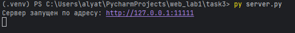
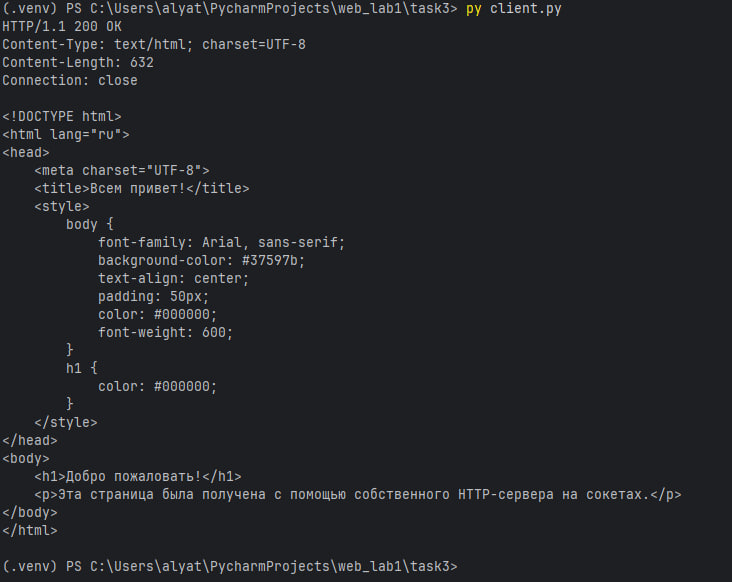
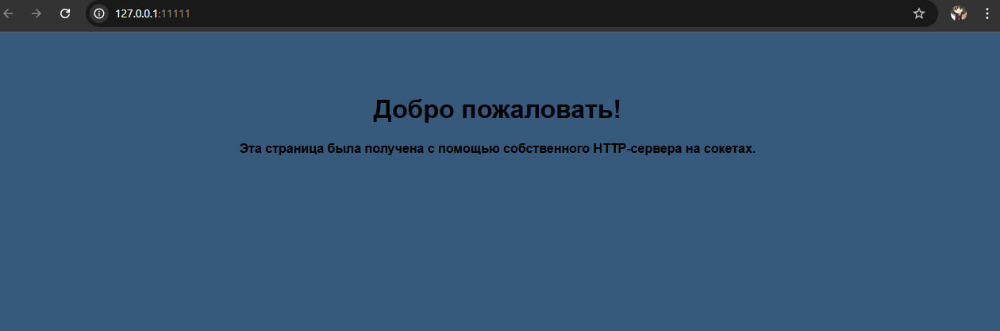

# Задание 3: HTTP-сервер на сокетах

## Условие
Реализовать серверную часть приложения. Клиент подключается к серверу, и в ответ получает HTTP-сообщение, содержащее HTML-страницу, которая сервер подгружает из файла index.html.

Требования:

- Обязательно использовать библиотеку `socket`

## Принцип работы
1. Клиент (client.py) отправляет HTTP-запрос типа GET на адрес сервера.

2. Сервер:
      - читает и разбирает запрос;
      - загружает файл index.html;
      - формирует и отправляет корректный HTTP-ответ с заголовками и телом;
      - в случае ошибки — формирует ответ с соответствующим кодом (404, 405).
3. Клиент получает HTML-страницу и отображает её.

## Код программы

### Сервер (server.py)

```
import socket
import html
import json
from urllib.parse import parse_qs

grades = {}

DATA_FILE = "grades.json"
TEMPLATE_FILE = "index.html"


def load_data():
    global grades
    try:
        with open(DATA_FILE, encoding="utf-8") as f:
            grades = json.load(f)
    except FileNotFoundError:
        grades = {}

def save_data():
    with open(DATA_FILE, "w", encoding="utf-8") as f:
        json.dump(grades, f, ensure_ascii=False, indent=2)


def handle_request(request):
    try:
        line, *_ = request.split("\r\n")
        method, path, _ = line.split()
    except ValueError:
        return response("400 Bad Request", "Неверный запрос")

    if method == "GET" and path == "/":
        return generate_html()

    if method == "POST" and path == "/add":
        try:
            body = request.split("\r\n\r\n", 1)[1]
            data = parse_qs(body)
            subject = data.get("subject", [""])[0].strip()
            grade = data.get("grade", [""])[0].strip()

            if not subject or not grade.isdigit():
                raise ValueError

            grade_int = int(grade)
            if not (1 <= grade_int <= 5):
                raise ValueError

            # Добавляет ключ-значение в словарь
            grades.setdefault(subject, []).append(grade_int)
            save_data()

            # Редиректим после POST
            return response("303 See Other", "", {"Location": "/"})

        except Exception:
            return response("400 Bad Request", "Неверные данные")

    return response("404 Not Found", "Страница не найдена")


def generate_html():
    try:
        with open(TEMPLATE_FILE, encoding="utf-8") as f:
            template = f.read()
    except FileNotFoundError:
        return response("500 Internal Server Error", "Нет шаблона")

    rows = []
    for subj, marks in grades.items():
        safe_subj = html.escape(subj)
        marks_str = ", ".join(map(str, marks))
        rows.append(f"<tr><td>{safe_subj}</td><td>{marks_str}</td></tr>")

    table = "\n".join(rows) or "<tr><td colspan=2><em>Пока пусто</em></td></tr>"
    html_page = template.replace("{{rows}}", table)

    return response("200 OK", html_page, {
        "Content-Type": "text/html; charset=utf-8"
    })


def response(status, body, headers=None):
    headers = headers or {}
    body_bytes = body.encode("utf-8")
    headers["Content-Length"] = str(len(body_bytes))
    headers.setdefault("Content-Type", "text/plain; charset=utf-8")

    head = "".join(f"{k}: {v}\r\n" for k, v in headers.items())
    return f"HTTP/1.1 {status}\r\n{head}\r\n{body}"


def run_server():
    load_data()
    with socket.socket(socket.AF_INET, socket.SOCK_STREAM) as server_socket:
        server_socket.setsockopt(socket.SOL_SOCKET, socket.SO_REUSEADDR, 1)
        server_socket.bind(("127.0.0.1", 11111))
        server_socket.listen()
        print(f"Сервер запущен: http://127.0.0.1:11111")
        while True:
            client_socket, _ = server_socket.accept()
            with client_socket:
                req = client_socket.recv(4096).decode("utf-8")
                resp = handle_request(req)
                client_socket.sendall(resp.encode("utf-8"))


if __name__ == "__main__":
    run_server()
```
### Клиент (client.py)
```
import socket

def run_client():
    with socket.socket(socket.AF_INET, socket.SOCK_STREAM) as client_socket:
        client_socket.connect(('127.0.0.1', 11111))
        request = (
            "GET / HTTP/1.1\r\n"
            f"Host: 127.0.0.1:11111\r\n"
            "Connection: close\r\n"
            "\r\n"
        )
        client_socket.sendall(request.encode("UTF-8"))

        response = b""
        while True:
            data = client_socket.recv(1024)
            if not data:
                break
            response += data

        print(response.decode("utf-8"))

if __name__ == "__main__":
        run_client()
```
### HTML-страница (index.html)

```
<!DOCTYPE html>
<html lang="ru">
<head>
    <meta charset="UTF-8">
    <title>Всем привет!</title>
    <style>
        body {
            font-family: Arial, sans-serif;
            background-color: #37597b;
            text-align: center;
            padding: 50px;
            color: #000000;
            font-weight: 600;
        }
        h1 {
            color: #000000;
        }
    </style>
</head>
<body>
    <h1>Добро пожаловать!</h1>
    <p>Эта страница была получена с помощью собственного HTTP-сервера на сокетах.</p>
</body>
</html>
```

## Запуск

1. Необходимо открыть два терминала.
2. В первом запустите сервер:
`py server.py`
3. Во втором терминале запустите клиент:
`py client.py`
4. Перейдите по ссылке, указанной в терминале.

## Результат

Cо стороны сервера видим следующее: 

Cо стороны клиента видим: 

Переходим по адресу, указанному в терминале: [http://127.0.0.1:11111](http://127.0.0.1:11111)

Видим HTML-страницу, полученную при помощи сервера: 

Значит, цели задания выполнены.

## Выводы
1. Реализован собственный HTTP-сервер с использованием библиотеки socket и протокола TCP.

2. Сервер корректно обрабатывает запросы типа GET и возвращает содержимое HTML-файла.

3. Обработаны основные ошибки: отсутствие файла (404) и неподдерживаемые методы (405).

4. Задание позволило понять базовые принципы работы HTTP-протокола на низком уровне.
