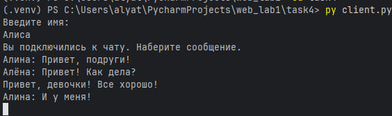

# Задание 4: Многопользовательский чат на TCP

## Условие

Реализовать многопользовательский чат. 

*Требования*:

- Обязательно использовать библиотеку `socket`.
- Для многопользовательского чата необходимо использовать библиотеку `threading`.

*Реализация*:

- Протокол TCP: 100% баллов.
- Протокол UDP: 80% баллов.
- Для UDP используйте threading для получения сообщений на клиенте.
- Для TCP запустите клиентские подключения и обработку сообщений от всех пользователей в потоках. Не забудьте сохранять пользователей, чтобы отправлять им сообщения.

## Принцип работы

1. Сервер:
    - запускается и слушает входящие подключения; 
    - при подключении нового клиента — создаёт поток для его обработки; 
    - хранит список всех подключённых клиентов; 
    - пересылает каждое полученное сообщение всем остальным клиентам.

2. Клиент:
    - подключается к серверу; 
    - в одном потоке — отправляет сообщения; 
    - в другом потоке — принимает сообщения от сервера и отображает их.

3. Работа в реальном времени достигается за счёт потоков, обрабатывающих ввод и вывод параллельно.

## Код программы

### Сервер (server.py)

```
import socket
import threading

# Блокировка для безопасной работы с clients из разных потоков
clients = {}  # {socket: name}
clients_lock = threading.Lock()

def broadcast(message, sender_socket=None):
    with clients_lock:
        receivers = [c for c in clients.keys() if c != sender_socket]
        for client in receivers:
            try:
                client.sendall(message.encode("UTF-8"))
            except (ConnectionResetError, ConnectionAbortedError, OSError) as e:
                print(f"Ошибка соединения: {e}")
                client.close()
                with clients_lock:
                    clients.pop(client, None)

def handle_client(sock, address):
    try:
        sock.send("Введите имя: ".encode('UTF-8'))
        name = sock.recv(1024).decode('UTF-8').strip()
        # регистрируем клиента
        with clients_lock:
            clients[sock] = name
        sock.send("Вы подключились к чату. Наберите сообщение.".encode('UTF-8'))
        broadcast(f"Пользователь {name} присоединился к чату.", sender_socket=sock)

        while True:
            client_msg = sock.recv(1024)
            if not client_msg:
                break # Если пусто - клиент отключился
            broadcast(f"{name}: {client_msg.decode('UTF-8').strip()}", sender_socket=sock)
    finally:
        with clients_lock:
            username = clients.pop(sock, 'Неизвестный')  # Удаляем пользователя
        broadcast(f"Пользователь  {username} вышел из чата.")
        sock.close()


def run_server():
    with socket.socket(socket.AF_INET, socket.SOCK_STREAM) as server_socket:
        server_socket.setsockopt(socket.SOL_SOCKET, socket.SO_REUSEADDR, 1)
        server_socket.bind(('127.0.0.1', 11111))
        server_socket.listen()
        print("Сервер запущен на 127.0.0.1:11111")

        while True:
            client_socket, client_address = server_socket.accept()
            # Для каждого клиента запускаем отдельный поток
            threading.Thread(
                target=handle_client,
                args=(client_socket, client_address),
                daemon=True
            ).start()

if __name__ == "__main__":
    run_server()
```

### Клиент (client.py)

```
import socket
import threading

def receive_messages(sock):
    while True:
        try:
            message = sock.recv(1024)
            if not message:
                print("Соединение закрыто сервером.")
                break
            print(message.decode('UTF-8'))
        except (ConnectionResetError, ConnectionAbortedError, OSError) as e:
            print(f"Ошибка соединения: {e}")
            break

def run_client():
    with socket.socket(socket.AF_INET, socket.SOCK_STREAM) as client_socket:
        client_socket.connect(('127.0.0.1', 11111))
        # Запускаем отдельный поток для получения и печати входящих сообщений
        threading.Thread(
            target=receive_messages,
            args=(client_socket,),
            daemon=True
        ).start()
        while True:
            try:
                message = input()
                if message:
                    client_socket.send(message.encode('UTF-8'))
            except (ConnectionResetError, ConnectionAbortedError, OSError) as e:
                print(f"Ошибка соединения: {e}")
                break

if __name__ == "__main__":
    run_client()
```

## Запуск

1. Необходимо открыть два терминала.
2. В первом запустите сервер:
`py server.py`
3. Во других трёх терминалах запустите клиент:
`py client.py`
4. Для каждого клиента введите имя. 
5. Можно набирать сообщения.

## Результат

Запустив сервер, видим: 

Запускаем трёх клиентов. Набираем сообщения. 

Терминал первого клиента:


Терминал второго клиента:


Терминал третьего клиента:


Один клиент отсоединился. Что отображается в терминалах других клиентов:


Сообщения пользователя отображаются в терминалах других клиентов, но не в его. Цели задания выполнены.

## Выводы

1. Реализован многопользовательский чат с использованием `socket`, `threading` и TCP.
2. Сервер поддерживает несколько одновременных подключений, обрабатывая каждого клиента в отдельном потоке.
3. Сообщения корректно доставляются между всеми клиентами в реальном времени.
4. Приложение продемонстрировало устойчивую работу при подключении/отключении клиентов.
