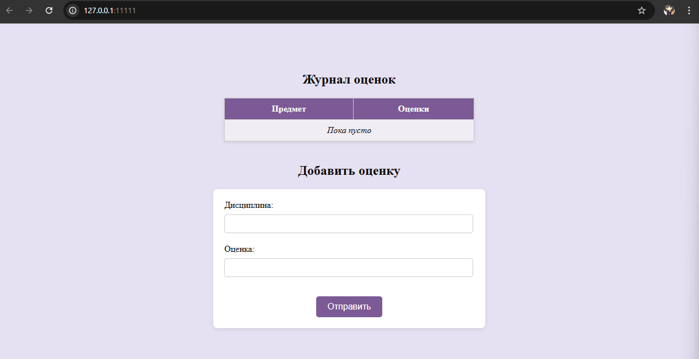
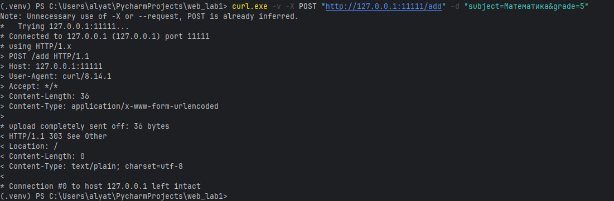
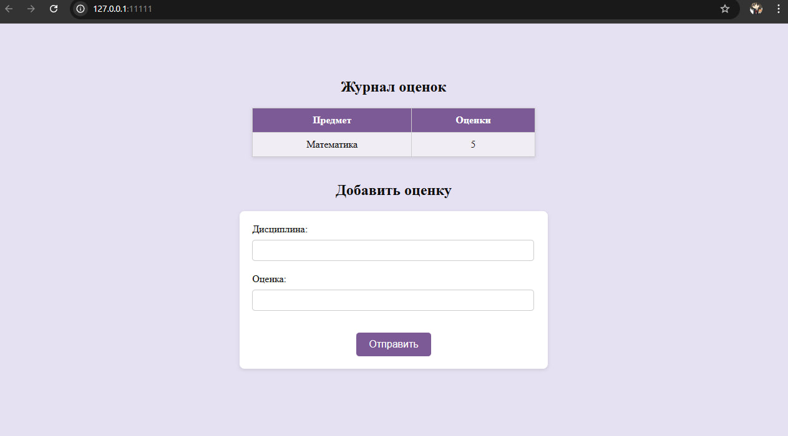
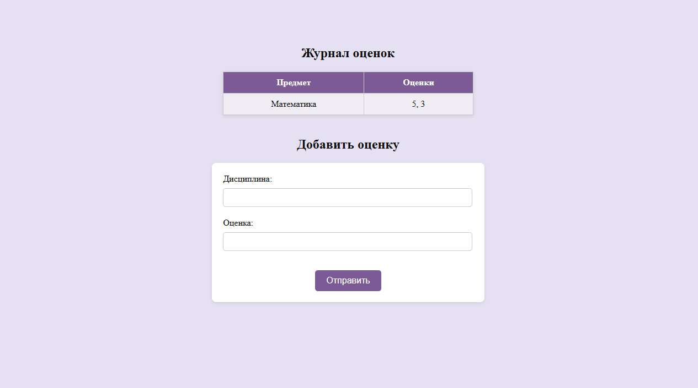
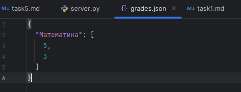

# Задание 5: HTTP-сервер с поддержкой GET и POST-запросов

## Условие
Написать простой веб-сервер для обработки `GET` и `POST` HTTP-запросов с помощью библиотеки `socket` в Python.

Сервер должен:

- Принять и записать информацию о дисциплине и оценке по дисциплине. 
- Отдать информацию обо всех оценках по дисциплинам в виде HTML-страницы.

## Принцип работы

1. При `GET /` сервер загружает данные об оценках и возвращает HTML-страницу с таблицей.
2. При `POST /add` сервер принимает данные из формы (дисциплина и оценка), сохраняет их и перенаправляет обратно на главную.
3. Все данные сохраняются в JSON-файл, который используется при каждом новом запросе.
4. Вся обработка запросов реализована вручную через `socket` и TCP.

## Код программы

### Сервер (server.py)

```
import socket
import html
import json
from urllib.parse import parse_qs

grades = {}

DATA_FILE = "grades.json"
TEMPLATE_FILE = "index.html"


def load_data():
    global grades
    try:
        with open(DATA_FILE, encoding="utf-8") as f:
            grades = json.load(f)
    except FileNotFoundError:
        grades = {}

def save_data():
    with open(DATA_FILE, "w", encoding="utf-8") as f:
        json.dump(grades, f, ensure_ascii=False, indent=2)


def handle_request(request):
    try:
        line, *_ = request.split("\r\n")
        method, path, _ = line.split()
    except ValueError:
        return response("400 Bad Request", "Неверный запрос")

    if method == "GET" and path == "/":
        return generate_html()

    if method == "POST" and path == "/add":
        try:
            body = request.split("\r\n\r\n", 1)[1]
            data = parse_qs(body)
            subject = data.get("subject", [""])[0].strip()
            grade = data.get("grade", [""])[0].strip()

            if not subject or not grade.isdigit():
                raise ValueError

            grade_int = int(grade)
            if not (1 <= grade_int <= 5):
                raise ValueError

            # Добавляет ключ-значение в словарь
            grades.setdefault(subject, []).append(grade_int)
            save_data()

            # Редиректим после POST
            return response("303 See Other", "", {"Location": "/"})

        except Exception:
            return response("400 Bad Request", "Неверные данные")

    return response("404 Not Found", "Страница не найдена")


def generate_html():
    try:
        with open(TEMPLATE_FILE, encoding="utf-8") as f:
            template = f.read()
    except FileNotFoundError:
        return response("500 Internal Server Error", "Нет шаблона")

    rows = []
    for subj, marks in grades.items():
        safe_subj = html.escape(subj)
        marks_str = ", ".join(map(str, marks))
        rows.append(f"<tr><td>{safe_subj}</td><td>{marks_str}</td></tr>")

    table = "\n".join(rows) or "<tr><td colspan=2><em>Пока пусто</em></td></tr>"
    html_page = template.replace("{{rows}}", table)

    return response("200 OK", html_page, {
        "Content-Type": "text/html; charset=utf-8"
    })


def response(status, body, headers=None):
    headers = headers or {}
    body_bytes = body.encode("utf-8")
    headers["Content-Length"] = str(len(body_bytes))
    headers.setdefault("Content-Type", "text/plain; charset=utf-8")

    head = "".join(f"{k}: {v}\r\n" for k, v in headers.items())
    return f"HTTP/1.1 {status}\r\n{head}\r\n{body}"


def run_server():
    load_data()
    with socket.socket(socket.AF_INET, socket.SOCK_STREAM) as server_socket:
        server_socket.setsockopt(socket.SOL_SOCKET, socket.SO_REUSEADDR, 1)
        server_socket.bind(("127.0.0.1", 11111))
        server_socket.listen()
        print(f"Сервер запущен: http://127.0.0.1:11111")
        while True:
            client_socket, _ = server_socket.accept()
            with client_socket:
                req = client_socket.recv(4096).decode("utf-8")
                resp = handle_request(req)
                client_socket.sendall(resp.encode("utf-8"))


if __name__ == "__main__":
    run_server()
```

### HTML-страница (index.html)

```
<!DOCTYPE html>
<html lang="ru">
<head>
  <meta charset="UTF-8">
  <title>Журнал оценок</title>
  <style>
    body {
      background: #e6e1f2;
      color: #0a0a0a;
      padding: 5%;
    }

    h1, h2 {
      text-align: center;
      color: #0a0a0a;
      font-weight: 600;
      font-size: 24px;
    }

    table {
      width: 40%;
      margin: 20px auto;
      border-collapse: collapse;
      background: #fff;
      box-shadow: 0 2px 6px rgba(0,0,0,0.1);
      margin-bottom: 40px;
    }

    th, td {
      padding: 10px 15px;
      border: 1px solid #ccc;
      text-align: center;
    }

    th {
      background: #7b5a96;
      color: white;
      font-weight: bold;
    }

    tr:nth-child(even) {
      background: #f1edf5;
    }

    form {
      width: 40%;
      margin: 20px auto;
      padding: 20px;
      background: #fff;
      border-radius: 8px;
      box-shadow: 0 2px 6px rgba(0,0,0,0.1);
    }

    form input {
      padding: 8px;
      margin: 8px 0px 20px 0px;
      width: calc(100% - 20px);
      border: 1px solid #ccc;
      border-radius: 5px;
      font-size: 14px;
    }

    button {
      display: block;
      margin: 15px auto 0;
      padding: 10px 20px;
      background: #7b5a96;
      color: white;
      border: none;
      border-radius: 5px;
      font-size: 16px;
      cursor: pointer;
      transition: background 0.3s;
    }

    button:hover {
      background: #543e66;
    }
  </style>
</head>
<body>
  <h1>Журнал оценок</h1>
  <table>
    <tr><th>Предмет</th><th>Оценки</th></tr>
    {{rows}}
  </table>

  <h2>Добавить оценку</h2>
  <form method="POST" action="/add">
    <label>Дисциплина:</label>
    <input name="subject">

    <label>Оценка:</label>
    <input name="grade" type="number" min="1" max="5">

    <button type="submit">Отправить</button>
  </form>
</body>
</html>
```

### JSON

Для обеспечения сохранности введённых данных между перезапусками сервера используется файл `grades.json`.  
В этот файл сохраняются все переданные через POST-запросы дисциплины и оценки.


После каждого нового POST-запроса:

- Новая пара "дисциплина — оценка" добавляется в словарь.
- Обновлённые данные записываются обратно в файл `grades.json` с использованием модуля `json`.

Так сервер сохраняет состояние даже после перезапуска, не теряя ранее введённые оценки.


## Запуск

1. Необходимо открыть терминал.
2. В терминале запустите сервер:
3. Протестируйте работу напрямую через браузер, либо через curl:
``` curl.exe -v -X POST "http://127.0.0.1:11111/add" -d "subject=Математика&grade=5"```

## Результат

Cо стороны сервера видим следующее: 
[task5_server](assets/task5_server.jpg)

Заходим в браузер по адресу, указанному в терминале. Видим журнал: 

Попробуем протестировать работу сервера через curl: 

Успешно. Что мы видим в браузере: 

Протестировать работу можно и напрямую через интерфейс html-страницы. Вводим в поля предмет и оценку, нажимаем "Отправить". Журнал обновился:


Посмотрим json, чтобы убедиться, что оценки сохранились и что они появятся при перезапуске сервера: 



Все тесты успешны, и данные по оценкам за предметы сохранились в json. Значит, цели задания выполнены.

## Выводы
1. Реализован базовый HTTP-сервер с поддержкой обработки GET и POST-запросов на socket и TCP.
2. Сервер принимает оценки по дисциплинам и сохраняет их в JSON-файл.
3. На GET-запрос возвращается HTML-страница со всеми сохранёнными оценками.
4. Работа над заданием позволила глубже понять принципы HTTP и обработку формы без фреймворков.
