# Лабораторная работа 4. Реализация клиентской части средствами ~~Vue.js~~ Angular.

---
Так как разрешили использовать другой фреймворк, я решил попробовать Angular.  

## Введение  
[Вариант №1](https://drive.google.com/file/d/174gPjJ7AOHfzteYcobPY0x7sFBTkN1Xx/view) из вариантов по курсу «Основы баз данных».  
> Создать программную систему, предназначенную для администратора гостиницы. 
> Такая система должна обеспечивать хранение сведений об имеющихся в гостинице номерах, о проживающих в гостинице клиентах и о служащих, убирающихся в номерах. Количество номеров в гостинице известно, и имеются номера трех типов: одноместный, двухместный и трехместный, отличающиеся стоимостью проживания в сутки. В каждом номере есть телефон.

## Интерфейсы  
### Основные страницы  
Главная страница  
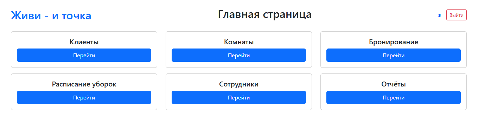  

Страница с отображением данных администратора (текущего пользователя)  
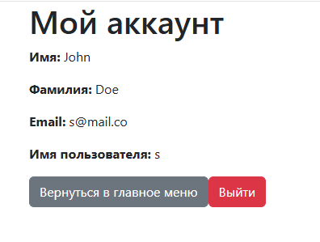  

---
### Аутентификация  
Вход  
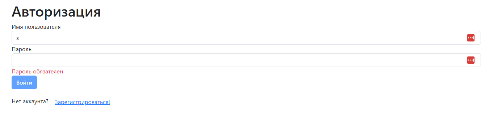  

Регистрация  
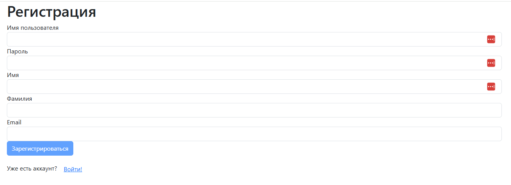  

---
### Страница клиентов  
Общий вид
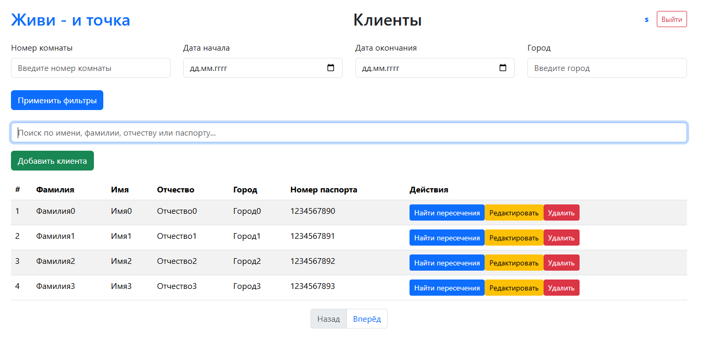  

Форма редактирования клиента  
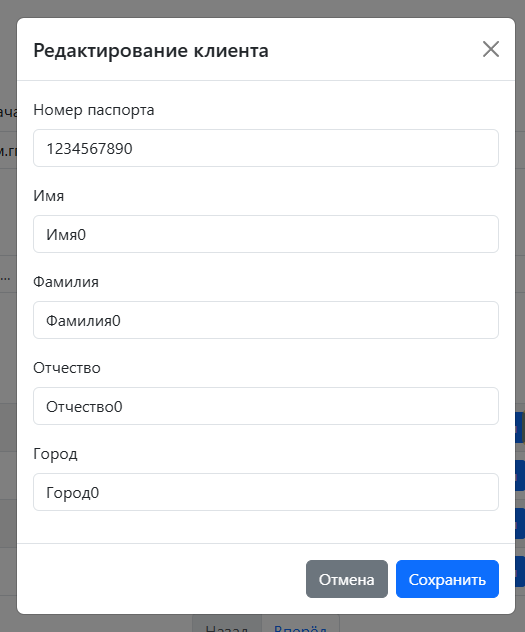  

Страница с отображением пересечений  
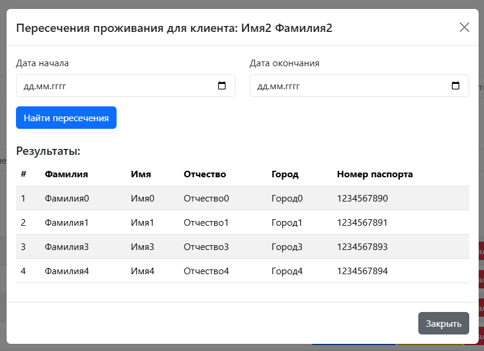  

---
### Страница с номерами  
Общий вид  
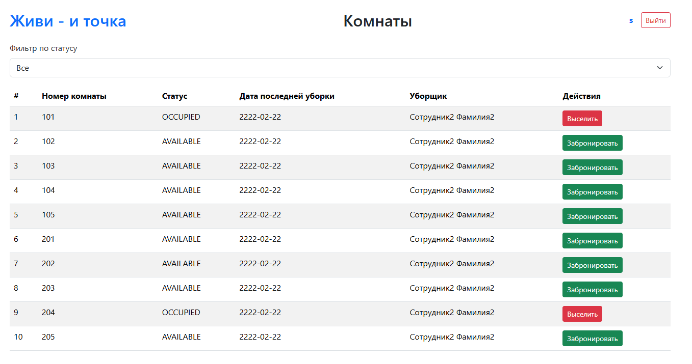  

Выпадающий список фильтра по статусу  
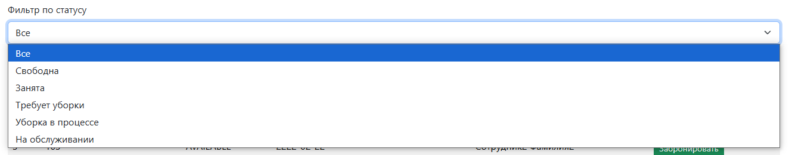  

---
### Страница с бронированием  
Общий вид  
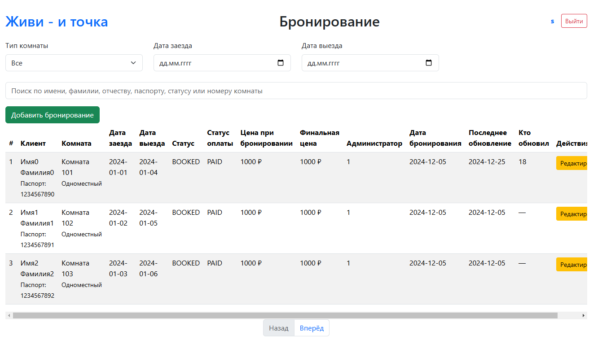  

Форма создания новой брони  
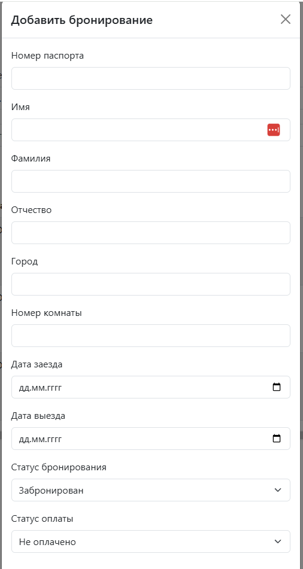  

Форма редактирования существующей брони  
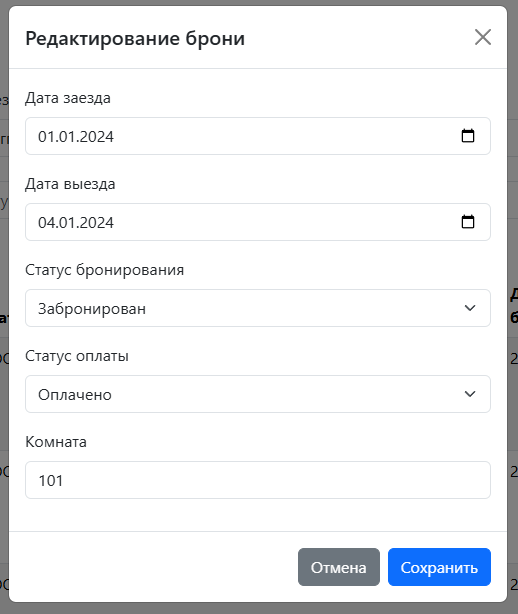  

---
### Страница с расписанием уборок  
Общий вид  
  

Страница добавления расписания  
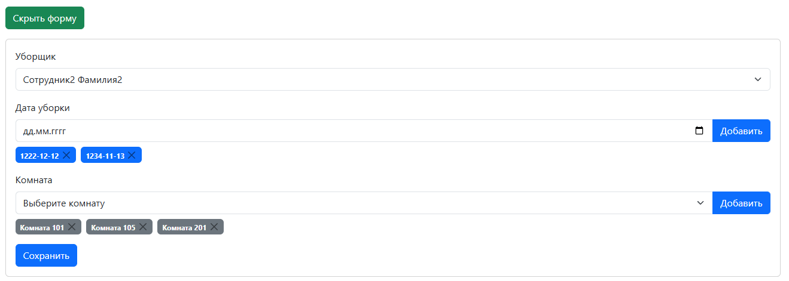  

---
### Страница сотрудников  
Общий вид  
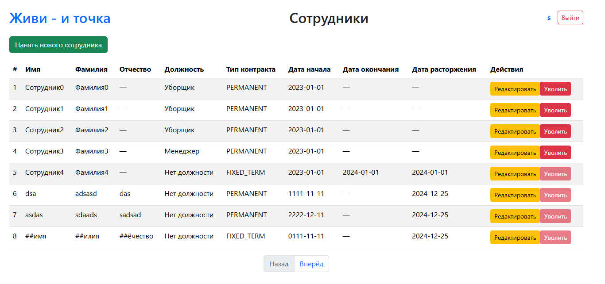  

Форма редактирования сотрудника  
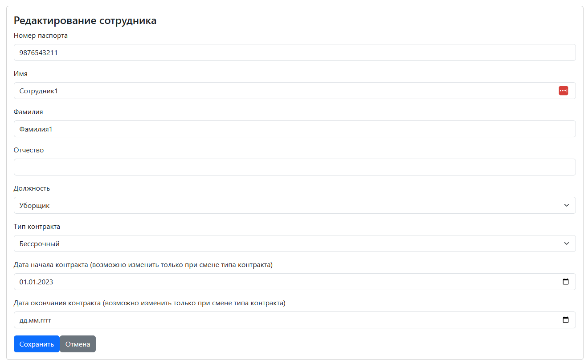  

---
### Страница с отчётами  
Общий вид  
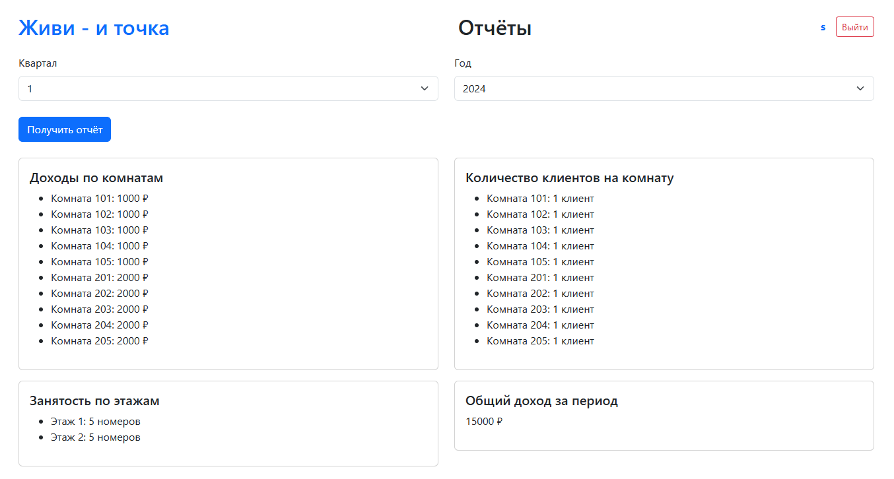  